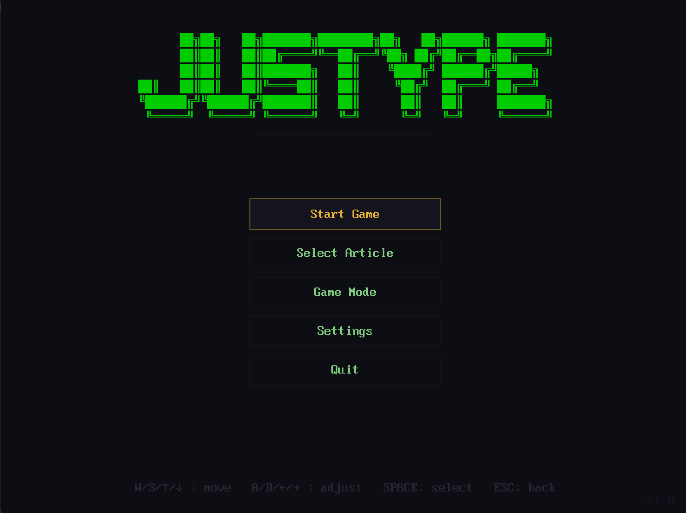
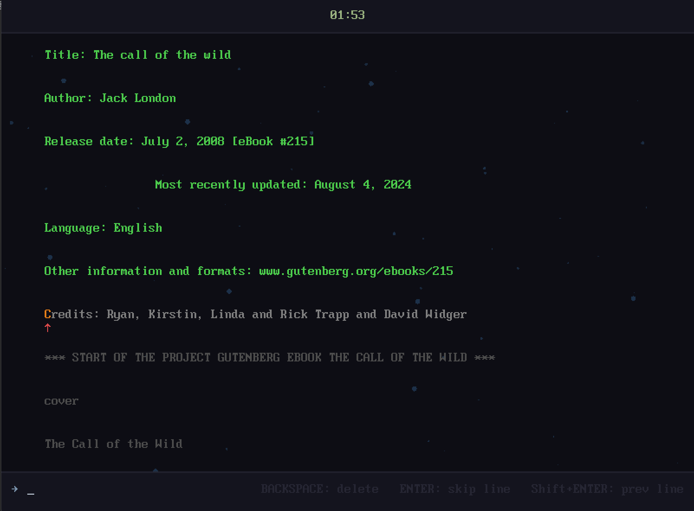

# Justype

A DOS-style typing game made with LÖVE2D.

## Game Modes

- **Arcade Mode** — Words move from right to left. Type them correctly before they reach the edge. Miss too many and the game ends. Fast-paced and challenging.
- **Zen Mode** — Type entire articles line by line. No pressure, no penalties. Just focus and type at your own pace.

## Configuration

The config file is named `config.lua` and is stored in `love.filesystem.getSaveDirectory()`:

- **Windows**: `%APPDATA%\LOVE\justype\`
- **macOS**: `~/Library/Application Support/LOVE/justype/`
- **Linux**: `~/.local/share/love/justype/`

To add custom music or assets, place your files in the game directory and use relative paths in the config.

If something goes wrong, simply delete the old config file to restore default settings.

## Screenshots

  
  
  

## Controls

- `W/S/↑/↓` — navigate
- `A/D/←/→` - adjust
- `SPACE` — select
- `ESC` — return to menu
- `Ctrl+U` — clear input (Arcade mode)
- `BACKSPACE` — delete a character (Arcade and zen mode)
- `ENTER` — skip current line (Zen mode)
- `Shift+ENTER` — back to previous line (Zen mode)

## Credits

- **Bisqwit** — inspiration from WSpeed
- **fassounds** — "Good Night" (Lofi Cozy Chill Music) — Arcade mode BGM
- **psychronic** — "Fight for the Future" — Zen mode BGM
- **Project Gutenberg** — public domain texts

## License

- Code: MIT
- Music: Royalty-free from Pixabay — free for commercial use, no attribution required
- Texts: Public Domain
