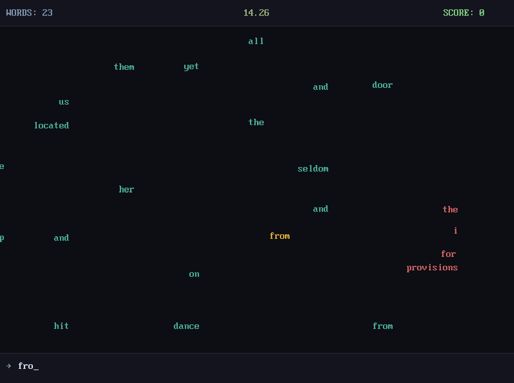

# Justype

A DOS-style typing game made with LÖVE2D. Type moving words before they reach the edge.

## Screenshots

*Gameplay — type words before they reach the right edge*

*Main menu with retro DOS aesthetic*

## Controls

- `W/S/↑/↓` — navigate
- `SPACE` — select
- `BACKSPACE` — back
- `ESC` — return to menu / quit
- `Ctrl+U` — clear input (in-game)

## Credits

- **Bisqwit** — inspiration from WSpeed
- **nu11** — music "Tower of Dreams"
- **Project Gutenberg** — public domain texts

## License

- Code: MIT
- Music: "Tower of Dreams" by nu11 — all rights reserved. Used without permission (personal project only). Remove upon request.
- Texts: public domain
